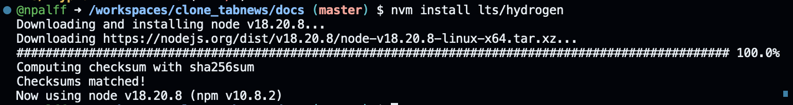

> "If you wish to make an apple pie from scratch you must first invent the universe" [Carl Sagan](https://youtu.be/s4VIc8Qt5xM?si=Vo2EzpAuIeQxphGH)


# Setup Environment
This project follows the guidelines from [curso.dev](https://curso.dev), maintaining a consistent development environment. The goal is to ensure compatibility across tool versions, enabling seamless feature implementation as outlined in the course.

This document covers:
- Recommended versions for each tool
- How to set up the environment locally
- How to install and manage specific tool versions required for this project

## Versioning:
- Node.js 18.20.8 LTS Hydrogen
- Next.js 13.1.6
- React.js 18.2.0
- React-dom 18.2.0

## Important commands

```
    # node.js version
    node -v
   
    #docker version
    docker -v
    
    ## NVM
    # nvm (Node Version Manager) version
    nvm -v
    #list all node versions
    ## lst version --> long term support - extended support (e.g. security patches)
    nvm ls
    # Install a custom version
    nvm install <version> # e.g nvm install lts/hydrogen
```



When working in remote environments, containers, or on local machines, you may need to repeat the setup every time you reboot or open a new terminal.
To avoid this, set a default Node.js version for the environment so the correct version is used automatically.

```
    # Set default node version on a shell
    nvm alias default <version> # e.g. nvm alias default lts/hydrogen
```


## Setup file
Setting a default Node.js version on a single machine - as the previous procedure - works for that machine, but in a shared repository you should specify the project version so everyone uses the same Node.js runtime.

Add a file named _.nvmrc_ (rc in the end --> Run Commands) at the repository root containing the desired Node.js version (for example: `18.20.8` or `lts/hydrogen`). This ensures tools like `nvm` automatically select the correct version when contributors enter the project directory.

With this file, running ```nvm install``` without any version will automatically install the defined version
